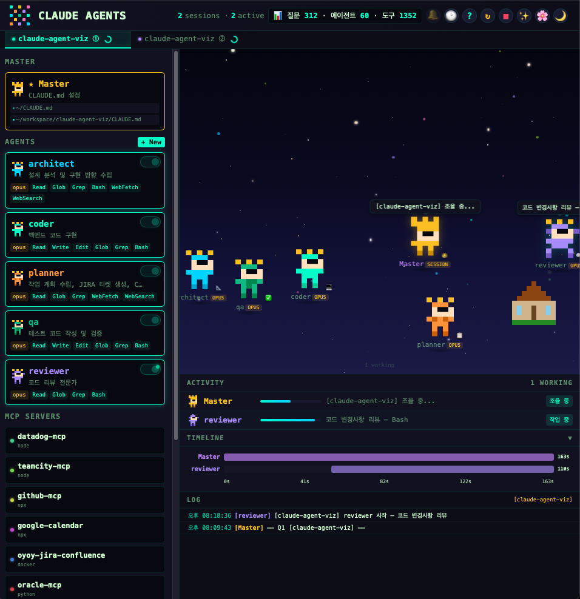
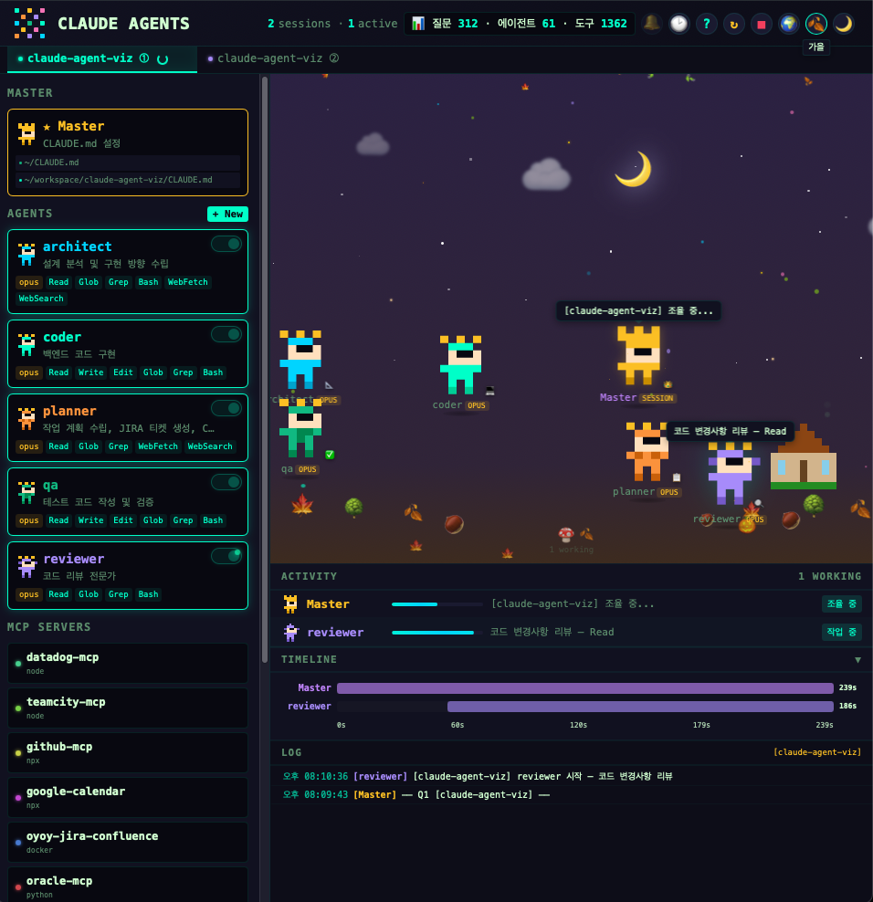

# Claude Agent Orchestrator

Claude Code의 에이전트 활동을 실시간으로 시각화하는 로컬 대시보드입니다.
픽셀아트 캐릭터들이 에이전트의 상태를 표현하고, 워크스페이스에서 자율적으로 활동합니다.

> 💡 **설치가 귀찮다면?** 이 README를 Claude Code에게 보여주고 "설치해줘"라고 하면 됩니다.





## 주요 기능

- **실시간 에이전트 모니터링** — SSE 기반으로 에이전트 시작/완료/도구 사용을 실시간 추적
- **픽셀아트 캐릭터** — 에이전트별 고유 캐릭터가 워크스페이스에서 배회, 수면, 작업
- **CLAUDE.md 편집** — 전역/프로젝트별 CLAUDE.md를 대시보드에서 직접 편집
- **에이전트 관리** — `~/.claude/agents/*.md` 파일 생성/편집/삭제
- **프로젝트별 에이전트 토글** — 프로젝트마다 사용할 에이전트를 on/off 설정
- **MCP 서버 목록** — 연결된 MCP 서버 현황 표시
- **Hooks 현황** — 설정된 훅 핸들러 목록 표시
- **타임라인** — Master + 에이전트 실행 시간 바 차트
- **세션 관리** — 멀티 세션 탭, 이름 변경, 상태 추적
- **환경 효과** — 낮/밤 사이클, 4계절 순환, 날씨 파티클, 우주 배경 모드
- **성능 최적화** — 탭 비활성 시 애니메이션 자동 정지, renderAll 디바운스

## 요구사항

- macOS (Linux 미테스트)
- Node.js 16+
- Claude Code CLI

## 설치

### 1. 파일 배치

```bash
# ~/.claude/agent-viz/ 에 프로젝트 파일 배치
git clone https://github.com/oy-snowwwww/claude-agent-viz.git ~/.claude/agent-viz
```

### 2. 실행 권한 부여

```bash
chmod +x ~/.claude/agent-viz/start.sh
chmod +x ~/.claude/agent-viz/hook-handler.sh
```

### 3. CLI 별칭 설정 (선택)

```bash
# ~/.zshrc 또는 ~/.bashrc에 추가
alias claude-agents="bash ~/.claude/agent-viz/start.sh"
```

### 4. Claude Code 훅 설정

`~/.claude/settings.json`의 `hooks` 섹션에 아래 내용을 추가합니다:

```json
{
  "hooks": {
    "SessionStart": [
      {
        "hooks": [
          {
            "type": "command",
            "command": "bash ~/.claude/agent-viz/start.sh auto"
          },
          {
            "type": "command",
            "command": "bash ~/.claude/agent-viz/hook-handler.sh session_start"
          }
        ]
      }
    ],
    "UserPromptSubmit": [
      {
        "hooks": [
          {
            "type": "command",
            "command": "bash ~/.claude/agent-viz/hook-handler.sh thinking_start"
          }
        ]
      }
    ],
    "Stop": [
      {
        "hooks": [
          {
            "type": "command",
            "command": "bash ~/.claude/agent-viz/hook-handler.sh thinking_end"
          }
        ]
      }
    ],
    "SessionEnd": [
      {
        "hooks": [
          {
            "type": "command",
            "command": "bash ~/.claude/agent-viz/hook-handler.sh session_end"
          }
        ]
      }
    ],
    "PreToolUse": [
      {
        "matcher": "Agent",
        "hooks": [
          {
            "type": "command",
            "command": "bash ~/.claude/agent-viz/hook-handler.sh agent_start"
          }
        ]
      },
      {
        "hooks": [
          {
            "type": "command",
            "command": "bash ~/.claude/agent-viz/hook-handler.sh tool_use"
          }
        ]
      }
    ],
    "PostToolUse": [
      {
        "matcher": "Agent",
        "hooks": [
          {
            "type": "command",
            "command": "bash ~/.claude/agent-viz/hook-handler.sh agent_done"
          }
        ]
      }
    ]
  }
}
```

## 사용법

### 서버 관리

```bash
claude-agents          # 서버 시작 + 브라우저 열기
claude-agents stop     # 서버 종료
claude-agents status   # 현재 상태 확인
claude-agents on       # 세션 시작 시 자동 실행 ON
claude-agents off      # 세션 시작 시 자동 실행 OFF
```

### 대시보드 UI

| 영역 | 설명 |
|------|------|
| **좌측 패널** | Master(CLAUDE.md), Agents(관리/토글), MCP 서버, Hooks |
| **워크스페이스** | 픽셀아트 캐릭터 + 환경 효과 (계절/날씨) |
| **액티비티** | 에이전트별 프로그레스 바 + 상태 |
| **타임라인** | Master + 에이전트 실행 시간 시각화 |
| **로그** | 실시간 이벤트 로그 |

### 헤더 버튼

| 버튼 | 기능 |
|------|------|
| ✨/🌍 | 환경 효과 on/off (우주 모드 ↔ 계절 모드) |
| 🌸/☀️/🍂/❄️ | 계절 전환 |
| Dark/Light | 테마 전환 |
| ? | 도움말 |
| ↻ | 서버 재시작 |
| ■ | 서버 종료 |

### 에이전트 토글

각 에이전트 카드의 토글 스위치로 프로젝트별 에이전트 활성화를 제어합니다.

**OFF하면?** 프로젝트 `CLAUDE.md` 끝에 아래 마커가 자동 삽입됩니다:

```html
<!-- agent-viz:agents coder, qa -->
<!-- 이 프로젝트에서는 위 에이전트만 사용한다 -->
```

Claude는 이 주석을 읽고 해당 에이전트만 사용합니다. 기존 CLAUDE.md 내용은 건드리지 않습니다.

- Master 작업 중에는 토글 변경 불가 (잠금)
- 전체 ON 시 제한 해제 (마커 제거)
- 전체 OFF 시 에이전트 미사용 (`none`)

## 주의사항

### CLAUDE.md는 git에 올리지 마세요

에이전트 토글 기능이 프로젝트 `CLAUDE.md`에 마커를 씁니다. 프로젝트의 `.gitignore`에 아래 항목을 추가하세요:

```
CLAUDE.md
.claude/
.mcp.json
```

## 설정

### 환경변수

| 변수 | 기본값 | 설명 |
|------|--------|------|
| `AGENT_VIZ_PORT` | `54321` | 서버 포트 |

### 파일 구조

```
~/.claude/agent-viz/
├── index.html          # 단일 파일 SPA (UI 전체)
├── server.js           # Node.js HTTP 서버
├── hook-handler.sh     # Claude Code 훅 → 서버 이벤트 브릿지
├── start.sh            # 서버 시작/종료/상태 CLI
├── enabled             # 자동 실행 플래그 (파일 존재 여부)
└── sessions/           # 활성 세션 PID 파일
```

## 화면에 뭐가 어디서 오는가

대시보드에 보이는 각 영역이 어떤 파일을 읽는지 매핑입니다.

| 대시보드 영역 | 데이터 소스 | 설명 |
|--------------|------------|------|
| **MASTER** (좌측) | `~/CLAUDE.md` + `<프로젝트>/CLAUDE.md` | 클릭하면 편집 가능 |
| **AGENTS** (좌측) | `~/.claude/agents/*.md` | 에이전트 카드 + 토글 |
| **에이전트 토글 on/off** | `<프로젝트>/CLAUDE.md`에 마커 저장 | 프로젝트별 에이전트 제한 |
| **MCP SERVERS** (좌측) | `~/.mcp.json` | 연결된 MCP 서버 목록 |
| **HOOKS** (좌측) | `~/.claude/settings.json` → hooks | 훅 핸들러 현황 |
| **워크스페이스 캐릭터** | `~/.claude/agents/*.md` + 실시간 이벤트 | 에이전트 상태 시각화 |
| **액티비티/타임라인/로그** | Claude Code 훅 이벤트 (실시간) | SSE로 수신 |

### 파일을 만들면 → 대시보드에 자동 반영

```
~/.claude/agents/my-agent.md 생성  →  좌측 AGENTS에 카드 표시 + 워크스페이스에 캐릭터 등장
~/.mcp.json에 서버 추가            →  좌측 MCP SERVERS에 표시
~/CLAUDE.md 수정                   →  MASTER에서 편집/확인 가능
```

## Claude Code 설정 구조 안내

이 도구는 Claude Code의 설정 파일들과 연동됩니다. 처음이라면 아래 구조를 참고하세요.

```
~/
├── CLAUDE.md                      # 전역 설정 (모든 프로젝트에 적용)
└── .claude/
    ├── settings.json              # Claude Code 설정 (hooks, permissions 등)
    ├── settings.local.json        # 로컬 설정 (gitignore 대상)
    ├── agents/                    # 에이전트 정의 (.md 파일)
    │   ├── coder.md
    │   ├── reviewer.md
    │   └── ...
    └── agent-viz/                 # ← 이 프로젝트
```

### 에이전트 파일 예시 (`~/.claude/agents/coder.md`)

```markdown
---
name: coder
description: 백엔드 코드 구현
tools: ["Read", "Write", "Edit", "Glob", "Grep", "Bash"]
model: sonnet
---

당신은 백엔드 개발자입니다.
코드를 구현하고 테스트를 작성합니다.
```

### 프로젝트 CLAUDE.md 예시 (`<프로젝트>/CLAUDE.md`)

```markdown
# 프로젝트 설정

## 기본 규칙
- Kotlin/Spring Boot 프로젝트
- 테스트는 JUnit5 사용

## 빌드
- ./gradlew build
```

### MCP 서버 설정 (`~/.mcp.json`)

```json
{
  "mcpServers": {
    "github-mcp": {
      "command": "npx",
      "args": ["-y", "@modelcontextprotocol/server-github"]
    }
  }
}
```

## 기술 스택

- **의존성 없음** — npm 패키지, 외부 CDN 없이 Node.js 내장 모듈만 사용
- **단일 HTML 파일** — CSS + JavaScript 인라인, 배포가 파일 하나로 완결
- **SSE (Server-Sent Events)** — 실시간 이벤트 스트리밍
- **Vanilla JavaScript** — 프레임워크 없는 순수 JS

## 라이선스

MIT
